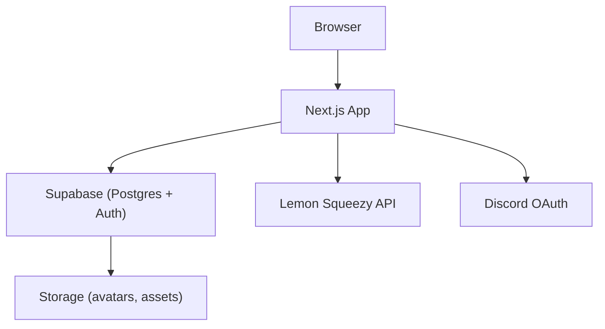

# Sword.lol

> Public user profiles with customization, follows, analytics, Discord OAuth, and Lemon Squeezy subscriptions — built with Next.js + Supabase.

[](https://nextjs.org/)
[](https://www.typescriptlang.org/)
[](https://supabase.com/)
[](https://docs.lemonsqueezy.com/)
[](https://discord.com/developers/docs/intro)

## ✨ Overview

Sword.lol is a lightweight public profile platform where users can:
- Create customizable profile pages: avatar, bio, theme, background YouTube video, location, badges and social links.
- Follow other users and view followers/following lists and counts.
- Track profile analytics (views, device, browser, country, session duration).
- Sign in via Discord (OAuth) and manage subscriptions via Lemon Squeezy.

## 🚀 Features

- Public profile pages at `/:username` with animated UI.
- Follow system with real-time follower/following counts and lists.
- Profile analytics (profile_views table with device/browser/country/session).
- Discord OAuth flow to upsert Discord data to users table.
- Lemon Squeezy checkout and server-side verification endpoint.
- Rich UI: Tailwind CSS, Framer Motion, Radix UI, React Icons, Bowser.

## 🛠️ Tech Stack

| Category | Technology |
|---|---|
| Framework | Next.js (App Router) |
| Language | TypeScript |
| DB / Auth | Supabase (Postgres + Auth + Storage) |
| Payments | Lemon Squeezy |
| OAuth | Discord |
| Styling | Tailwind CSS |
| UI / Motion | Radix UI, Framer Motion |
| Icons | React Icons |
| Browser detection | Bowser |

## 📁 Project Structure (high level)

```
app/                 # Next.js App Router pages and api routes
components/          # Reusable UI components
lib/                 # Helpers (supabase client, utils)
public/              # Static assets
scripts/             # DB / migration helpers (optional)
README.md
Context.md
```

## ⚙️ Environment Variables

Create `.env.local` in project root with the following keys:

```
NEXT_PUBLIC_SUPABASE_URL=
NEXT_PUBLIC_SUPABASE_ANON_KEY=

NEXT_PUBLIC_LEMON_SQUEEZY_STORE_ID=
NEXT_PUBLIC_LEMON_SQUEEZY_PREMIUM_VARIANT_ID=
NEXT_PUBLIC_LEMON_SQUEEZY_BASIC_VARIANT_ID=
LEMON_SQUEEZY_API_KEY=

DISCORD_CLIENT_ID=
DISCORD_CLIENT_SECRET=
```

Security notes:
- `LEMON_SQUEEZY_API_KEY` and `DISCORD_CLIENT_SECRET` are server-only secrets. Do not expose them to the client.
- Discord OAuth redirect is configured to `http://localhost:3000/auth/discord/callback` — update in Discord app settings and code if deploying.

## 💾 Database (Supabase) — Recommended SQL

Run in Supabase SQL editor. Adjust column types/constraints to taste.

```sql
-- Enable helpers
create extension if not exists "pgcrypto";

-- users
create table if not exists public.users (
  id uuid primary key default gen_random_uuid(),
  username text unique not null,
  email text,
  profile_pic text,
  bio text,
  theme jsonb,                 -- theme settings
  background_video text,
  location text,
  profile_views integer default 0,
  social_links jsonb,          -- { "twitter": "...", "github": "..."}
  badges text[],               -- ['Admin','OG']
  discord_id text,
  discord_username text,
  discord_avatar text,
  created_at timestamptz default now()
);

-- follows
create table if not exists public.follows (
  id uuid primary key default gen_random_uuid(),
  follower_id uuid references public.users(id) on delete cascade,
  following_id uuid references public.users(id) on delete cascade,
  created_at timestamptz default now(),
  unique (follower_id, following_id)
);

-- profile_views analytics
create table if not exists public.profile_views (
  id uuid primary key default gen_random_uuid(),
  user_id uuid references public.users(id) on delete cascade,
  viewer_id uuid references public.users(id),
  country text,
  device text,
  browser text,
  session_duration integer default 0,
  viewed_at timestamptz default now()
);

-- clicked_links
create table if not exists public.clicked_links (
  id uuid primary key default gen_random_uuid(),
  user_id uuid references public.users(id) on delete cascade,
  link text,
  clicked_at timestamptz default now()
);

-- Optional RPC: increment user profile_views
create or replace function public.increment_profile_views(target_id uuid)
returns void language plpgsql as $$
begin
  update public.users set profile_views = coalesce(profile_views,0) + 1 where id = target_id;
end;
$$;
```

## 🔌 API Routes (in app/api)

- GET /api/test-subscription — Builds Lemon Squeezy checkout URLs from env.
- GET /api/verify-lemonsqueezy — Verifies store/variant IDs using LEMON_SQUEEZY_API_KEY.
- GET /api/discord/callback — Discord OAuth code exchange; upserts discord fields to users.
- POST /api/profile-view — Log a profile view (inserts into profile_views and optionally increments users).
- POST /api/follow — Toggle follow/unfollow, returns follower/following counts.
- POST /api/link-click — Track social link clicks into clicked_links.

## 🔁 Key Flows

### Profile view flow
1. Client visits `/:username`.
2. Client calls `/api/profile-view` (sends viewer, country/device/browser).
3. Server inserts into `profile_views` and calls `increment_profile_views` RPC (or updates users.profile_views).

### Follow flow
1. Authenticated user clicks Follow.
2. Client calls `/api/follow` with follower_id and target_id.
3. Server inserts/deletes row in `follows`, returns updated counts.

### Discord OAuth
1. User clicks "Sign in with Discord".
2. OAuth redirect -> `/api/discord/callback?code=...`.
3. Route exchanges code for token, fetches Discord user, upserts into `users` (discord_id, avatar, username).

### Lemon Squeezy checkout
- Client builds checkout URL using `NEXT_PUBLIC_LEMON_SQUEEZY_STORE_ID` and variant IDs; server verifies purchases with `LEMON_SQUEEZY_API_KEY` via `/api/verify-lemonsqueezy` or webhook for production.

## 🧩 Local Development

Prereqs: Node 18+, npm

Windows commands:
```powershell
git clone <repo-url>
cd "e:\Programming Projects\Sword.lol"
npm install
copy .env.example .env.local   # or create .env.local manually and paste env vars
npm run dev
```

Open http://localhost:3000

## ✅ Testing & Debugging

- Verify env: open `/api/test-subscription` and `/api/verify-lemonsqueezy`.
- Test Discord flow locally by matching redirect URI in Discord app settings.
- Use Supabase SQL editor to inspect `users`, `follows`, `profile_views`, and `clicked_links`.

## 🔒 Security & Production Notes

- Enforce Row Level Security (RLS) on Supabase tables. Allow inserts for authenticated users when appropriate and restrict direct updates to owners.
- Use webhooks for Lemon Squeezy in production to confirm payments before granting entitlements.
- Do not expose server secrets in client code or public repos.
- Add OAuth state parameter and proper CSRF safeguards for the Discord flow.

## 🧭 Architecture Diagram

```mermaid
graph TB
  Browser --> NextApp[Next.js App]
  NextApp --> Supabase(Postgres + Auth)
  NextApp --> LemonSqueezy(Lemon Squeezy API)
  NextApp --> DiscordAPI(Discord OAuth)
  Supabase --> Storage[Storage (avatars, assets)]
```

## Contributing

1. Fork & clone
2. Create feature branch: git checkout -b feature/name// ...existing code...

## 🧭 Architecture Diagram



// ...existing code...
3. Add tests, follow code style
4. Open PR with clear description

## License

MIT

// ...existing code...